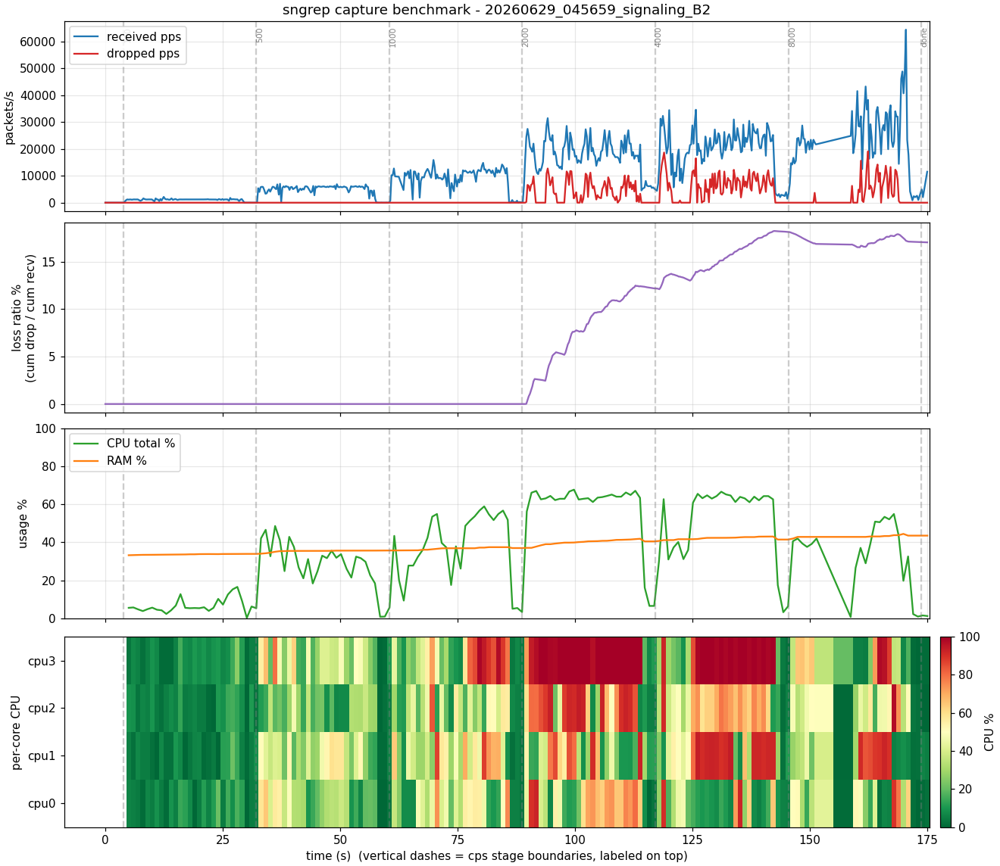
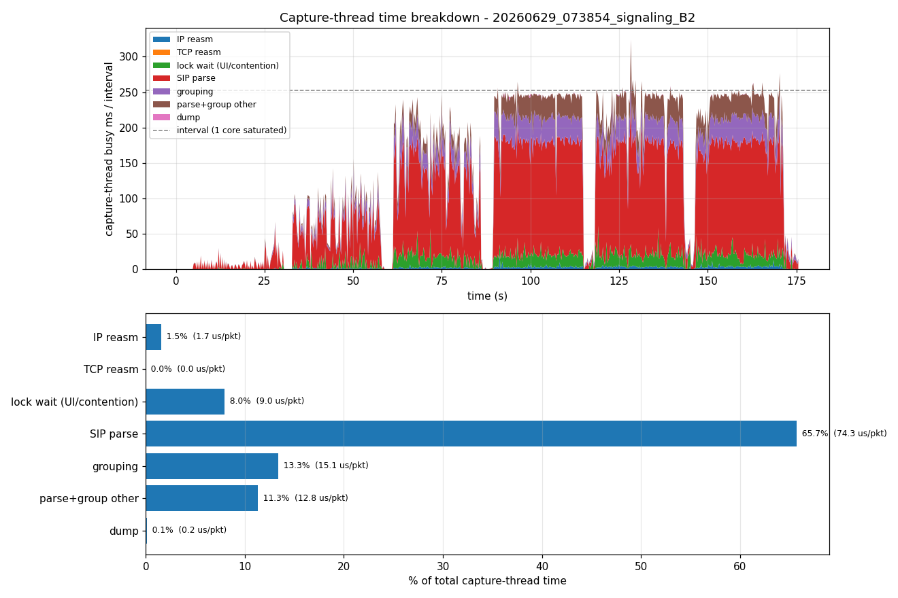
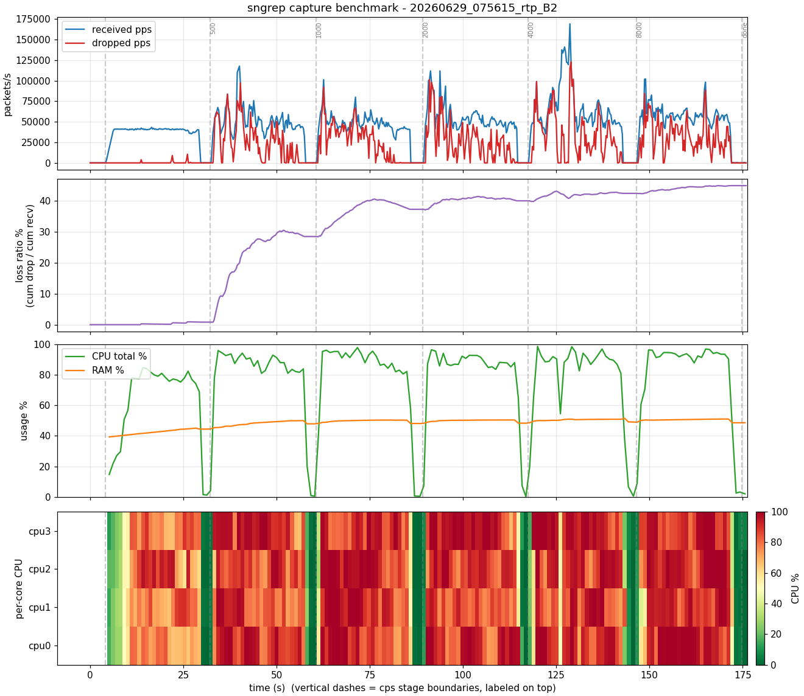

# 측정 결과 리포트

측정 환경은 Ubuntu 26.04 VM, 4 vCPU / 4GB, VirtualBox, 호스트 i5-1335U/16GB다.
트래픽은 VM 루프백이고 발신, 수신, 캡처가 모두 VM 내부다. 측정일은 2026-06-29다.

## 드롭 발생 여부, 위치

SIPp로 콜레이트를 100에서 8000 cps까지 올리며 pcap_stats를 샘플링했다.

- 드롭 발생: 시그널링 부하에서 누적 수십 % 손실이다. 17~45%로 측정마다 변동한다.
- 위치는 커널 캡처 링버퍼다. 드롭이 전부 ps_drop(커널 캡처 링버퍼)이고 ps_ifdrop(NIC)은 전 구간 0이다. NIC 한계가
  아니라 sngrep이 링버퍼를 못 비워서 생기는 현상이다.

### 버퍼를 키워도 드롭이 지속된다

| 링버퍼 -B | 누적 드롭% |
|---|---|
| 2 MB (기본) | 21.6% |
| 16 MB | 35.8% |
| 64 MB | 32.2% |

64MB는 약 0.67초치 버퍼인데도 32%가 지속적으로 빠졌다. 평균 처리율이 평균 도착율보다 낮은
지속 과부하에서는 버퍼가 넘침을 지연시킬 뿐 막지 못한다.

> 버퍼 크기와 드롭률은 일반적으로 반비례하지만, 이 측정의 절대 수치는 노이즈가 섞여 있어 정밀 비교에는 쓸 수 없다. 
> 다만 버퍼 크기와 무관하게 20% 이상 드롭이 지속되므로, 버퍼 확장이 근본적인 해결책이 아니라는 점은 명확하다.

### 리소스 영향은 없다

붕괴 시점에 cpu_all이 최대 60~68%이고 RAM 최저 여유가 약 1.9GB다. OOM이나 스왑은 없다.
코어가 놀고 메모리도 남는데 드롭하므로, 총 CPU 부족이 아니라 단일 스레드의 한계다. sngrep의
캡처+파싱+그룹화 스레드 하나가 코어 하나만 점유하고 남는 코어를 쓰지 못한다.

> cpu_all은 시스템 전체 수치라 SIPp 부하도 포함하지만, sngrep과 SIPp의 각 CPU 사용률과 
> 무관하게 결론은 같다. 전체가 60~68%라는 건 둘이 어떻게 나눠 쓰든 CPU 여유가 
> 있다는 뜻이므로, SIPp 부하는 이 결론에 영향을 주지 않는다.

## 단일 스레드의 단계별 처리 시간

parse_packet에 단계별 타이머를 추가하고, signaling 시나리오에서 cps를 단계적으로 올리며 측정했다.

| 단계 | 비중 | 총 시간 | 평균/패킷 |
|---|---|---|---|
| 파싱 + 그룹화 | 90.0% | 80.8 s | 104.4 µs |
| 락 대기 | 8.2% | 7.3 s | 9.5 µs |
| IP 재조립 | 1.7% | 1.5 s | 2.0 µs |
| dump | 0.1% | 0.12 s | 0.18 µs |
| TCP 재조립 | 0% | 0 | UDP라 없음 |

- 병목은 파싱+그룹화로 90%를 차지한다.
- 패킷당 약 112µs이므로 단일 스레드 처리율 천장은 약 9,000 pps다. 도착이 이를 넘으면
  링버퍼가 차서 드롭한다.
- 고레이트 구간에서 캡처 스레드의 단계별 시간 합이 샘플링 간격(약 250ms)의 96~100%를 채운다.
  스레드가 코어 하나를 포화시킨다는 뜻이다. 이 값은 프로파일러가 sngrep만 잰 것이라 시스템
  CPU나 SIPp와 무관하다.
- 락 대기는 8%다. 그룹화와 TUI 표시 경합이 있지만 부차적이다.

### 파싱 vs 그룹화

sip_check_packet에서 파싱과 그룹화 함수를 따로 측정했다.

| 구분 | 시간 | 단계(85.5s) 중 | 내용 |
|---|---|---|---|
| SIP 파싱 | 62.2 s | 72.7% | Call-ID·메서드·응답 추출. 패킷마다 regex, 약 74µs/패킷 |
| 그룹화 | 12.6 s | 14.8% | find/add/state/retrans, 약 15µs/패킷 |
| 기타 | 10.7 s | 12.5% | 페이로드 복사, 할당 등 |

파싱이 압도적이고 그룹화는 미미하다. 파싱은 패킷마다 독립적으로 도는 regex 작업이고,
그룹화는 Call-ID 맵을 공유하지만 단계의 15%에 그친다.

위 막대는 각 단계가 캡처 스레드 시간에서 차지하는 비중과 패킷당 평균이다. SIP 파싱이 대부분을
차지한다.

## RTP: 미디어 트래픽

SCENARIO=rtp로 측정했다. sngrep -r, SIPp가 PCMU 미디어 스트리밍, 동시통화 캡 2000이다.

| 관측 | 값 |
|---|---|
| RTP 캡처 | recv 7.7M, 정상 동작 |
| 볼륨 | 100cps만으로 약 42k pps, 시그널링 같은 레이트의 수배 |
| 드롭 | 100cps=0, 500cps부터 폭발해 누적 45%, peak 170k pps |
| CPU | 전 코어 약 90% 이상, cpu_all 98.5%로 거의 포화 |
| RAM | 1.75GB, 여유 |

- RTP는 통화당 약 100패킷이라(2s 미디어 @50pps) 시그널링보다 대용량이다. 100cps만으로 42k
  pps가 나온다.
- 시그널링과 달리 CPU가 전 코어 포화다. sngrep은 단일 스레드라 1코어만 쓰므로 나머지 포화는
  SIPp의 RTP 생성과 커널 softirq로 추정한다. 프로세스별 CPU는 미측정이다. RTP 절대 붕괴
  PPS는 발신측 경합에 오염되므로, 깨끗한 수치를 보려면 발신을 분리해야 한다.
- 현재 sngrep은 SIP과 RTP를 한 캡처 스레드와 한 링버퍼로 받는다. RTP가 공유 자원을 압도하면
  저빈도지만 중요한 SIP까지 같이 드롭될 수 있다.
- 단일 pcap 핸들이라 SIP 드롭과 RTP 드롭을 분리 측정하지 못한다.

## 종합 결론

1. sngrep은 고부하에서 커널 캡처 링버퍼에서 드롭한다(ps_drop, ifdrop=0).
2. 버퍼 확장으로는 못 고친다. 지속 과부하이기 때문이다.
3. 시그널링에서 원인은 자원 부족이 아니라 단일 스레드 직렬 처리다. 실질 처리율 천장은 약
   9,000 pps다.
4. 그 스레드 시간의 90%가 파싱+그룹화이고 그 중 파싱이 약 73%다. 패킷마다 regex를 돌린다.
5. RTP 미디어는 시그널링보다 수배 대용량이고 현재 SIP과 캡처 스레드·링버퍼를 공유한다.

## 남은 것 (정밀화)

정성 결론에는 불필요하고, 절대치를 다듬기 위한 측정이다.

- 발신 분리 재측정: taskset로 sngrep과 SIPp를 다른 코어에 고정하거나 별도 기기로 분리해
  경합 없는 RTP와 붕괴 수치를 얻는다.
- 프로세스별 CPU(pidstat -p <sngrep>)로 sngrep이 1코어만 쓰고 시스템에 여유가 있음을 직접
  확인한다.
- 반복과 발열 통제: 설정별 3회, 랜덤 순서로 변동을 제거한다.
- T3 버스트 vs 균일: 트래픽 패턴별 드롭 양상을 비교한다. 미측정이다.
- RTP가 실제 RTP 스트림으로 분류됐는지 확인한다. 현재는 바이트 캡처만 확인했다.
