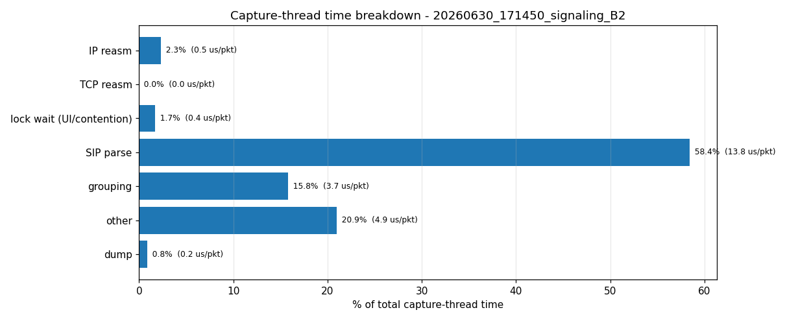

# 측정 결과 리포트

측정 환경: Ubuntu 26.04 VM, 4 vCPU / RAM 4GB / 디스크 25GB, VirtualBox (호스트 i5-1335U / 16GB).
트래픽은 lo 루프백이고 발신·수신·캡처가 모두 VM 내부다.

> **측정 신뢰도.** 이 노트북 환경에서 **절대 드롭률과 붕괴 PPS는 재현되지 않는다**(아래 "드롭률을
> 왜 못 믿나" 참고). 신뢰할 수 있는 건 sngrep 코드에서 나오는 양 — **패킷당 처리 비용** — 과,
> 변수를 통제한 **격리 실험의 방향성**이다. 절대 드롭률 수치는 지표로 쓰지 않는다.

## 패킷당 처리 비용 (가장 단단한 결과)

parse_packet에 패킷 타입별 타이머를 심어 측정했다. 타이머는 스레드 CPU 시간
(CLOCK_THREAD_CPUTIME_ID)이라 다른 프로세스의 선점에 부풀려지지 않는다.

| 패킷 타입 | 패킷당 CPU 비용 | 내용 |
|---|---|---|
| SIP (signaling) | 약 22 µs | Call-ID·메서드·응답 regex |
| SIP (rtp 시나리오) | 약 58 µs | INVITE에 SDP가 붙어 페이로드가 큼 |
| RTP | 약 3 µs | 헤더 디섹트 + 저장 |

- **SIP 파싱이 압도적으로 비싸다.** 같은 rtp 런 안에서 SIP 58µs vs RTP 3µs로 약 **18배**다.
  SIP는 패킷마다 페이로드 regex를 돌고 RTP는 헤더만 본다.
- SIP가 22µs(signaling)와 58µs(rtp)로 다른 건 노이즈가 아니라 메시지 크기 차이다. rtp 시나리오
  INVITE에 SDP가 실려 regex 대상이 커진다.
- 캡처+파싱은 단일 스레드라, 코어 하나로 처리할 수 있는 천장은 대략 (1코어)/(패킷당 비용)이다.
  SIP signaling 기준 1코어/22µs ≈ **45k pps**다(이 호스트 속도 기준, 절대값은 CPU에 따라 변함).

signaling에서 각 단계가 캡처 스레드 시간에 차지하는 비중이다. 파싱+그룹화가 거의 전부이고 그
안에서 SIP 파싱이 대부분이다. 재조립·dump·락 대기는 미미하다.

## RTP 드롭은 sngrep이 아니라 발신측 경합 때문이었다

RTP 시나리오는 SIP 통화에 RTP 미디어(SIPp가 PCMU pcap 재생)를 얹어 sngrep -r로 둘 다 캡처한다.
RTP는 통화당 약 100패킷(2s @50pps)이라 100cps만으로 수만 pps가 나온다.

발신측(SIPp)을 sngrep과 다른 코어로 떼면 결과가 뒤집힌다.

| RTP 런 | 배치 | 드롭% |
|---|---|---|
| 비격리 | sngrep·SIPp 코어 공유 | 6~16% |
| **격리 (PIN=1)** | sngrep 코어 0 전용, SIPp 1~3 | **0.007%** |

- proc.csv 실측: RTP 비격리 런에서 부하 구간 평균 **sngrep ~9% / SIPp ~73%**(피크 15/86) CPU다.
  RTP 미디어 재생은 SIPp가 스트림마다 스레드를 띄워 멀티코어로 돈다. 코어를 잡아먹은 건
  sngrep이 아니라 SIPp다.
- sngrep을 자기 코어에 격리하니 같은 RTP 볼륨을 0.007% 드롭으로 처리했다. **그동안의 RTP
  드롭은 발신측 SIPp가 sngrep 스레드의 CPU를 굶겨 생긴 아티팩트였다.** RTP 패킷 자체는 싸서
  (3µs) sngrep이 잘 따라간다.
- 한계: 단일 pcap 핸들이라 SIP 드롭과 RTP 드롭을 분리 측정하지는 못한다.

## 드롭률을 왜 못 믿나

같은 머신·같은 부하인데 드롭률이 제멋대로 나왔다. 단순 노이즈가 아니라 구조적 이유가 있다.

| 시나리오 | 관측된 드롭% (조건) |
|---|---|
| signaling | 0.2 (자유) / 5.6 (1코어 고정) / 10.5 (프로파일) / 17 (옛 런) |
| rtp | 0.007 (격리) / 6.6 / 16 / 45 (옛 런) |

- **VM은 호스트 변수를 격리하지 못한다.** vCPU는 호스트 물리 코어 위에서 돌아, 호스트 발열
  throttling이면 같이 느려지고 호스트 스케줄링 지터도 그대로 받는다.
- **용량 절벽.** sngrep이 한 코어 한계 근처(약 8000cps)에서 도니, 처리속도가 10~20%만 흔들려도
  "따라잡음(드롭 0)"과 "못 따라잡음(드롭 수십%)" 사이를 오간다.
- **재전송 피드백.** 드롭이 나면 SIP가 재전송해 트래픽이 더 늘고 그게 더 드롭을 부른다. 이
  쌍안정 구조라 결과가 0%나 수십%로 양극화된다.
- **프로파일 오버헤드.** PROFILE=1은 패킷마다 타이머를 호출해 캡처 스레드를 느리게 하므로,
  프로파일 런의 드롭은 드롭 전용(profile=0) 런보다 부풀려진다.

→ 절대 드롭률·붕괴 PPS는 이 환경에서 신뢰할 수 없다. 깨끗한 수치는 발열 없는 안정 머신과
발신 분리가 필요하다.

## 자원 (proc.csv)

| 시나리오 | sngrep CPU | SIPp CPU |
|---|---|---|
| signaling | 약 19% | 약 24% |
| rtp | 약 9% | 약 73% |

부하 구간 평균, 전체 4코어 대비 %다(프로파일 런이라 sngrep 쪽은 타이머 오버헤드가 약간 섞임).
sngrep은 두 경우 다 한 코어를 다 쓰지 않는다. RTP에서 CPU를 포화시키는 건 SIPp 미디어
스레드들이다. RAM은 -l/-R로 묶여 두 시나리오 다 평평하다(약 1.3~1.8GB).

## 종합 결론

1. **SIP 파싱이 비싼 경로다.** 패킷당 약 22µs(regex)로 RTP의 약 7배, 같은 런 비교로는 18배다.
   캡처+파싱은 단일 스레드라 SIP에서 코어 하나가 천장이다(이 호스트 ≈ 45k pps).
2. **RTP는 패킷당 싸고(3µs), 드롭은 sngrep이 아니라 발신측 SIPp 경합 아티팩트였다.** 격리하면
   같은 볼륨을 거의 안 떨군다.
3. **절대 드롭률은 이 환경에서 재현되지 않는다**(VM 미격리 + 용량 절벽 + 재전송 피드백). 지표로
   쓰지 않는다.
4. 떨굴 때는 전부 커널 캡처 링버퍼(ps_drop)에서 떨구고 NIC 드롭(ps_ifdrop)은 0이다. 유저공간이
   링버퍼를 못 비워서 생기는 드롭이다.

## 남은 것

- 안정 머신(발열 없는 데스크톱/베어메탈) + taskset 발신 분리로 절대 드롭률·붕괴 PPS를 깨끗이 측정.
- 설정별 반복(3회 이상)으로 변동을 정량화.
- RTP가 실제 RTP 스트림으로 분류됐는지 확인(현재는 바이트 캡처만 확인).
